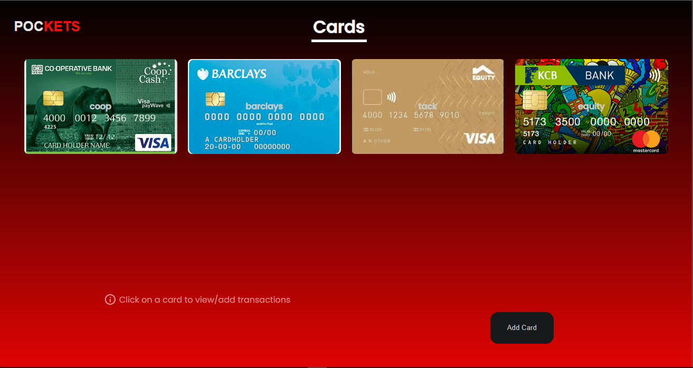
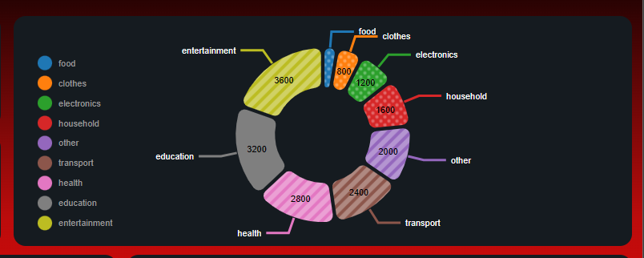
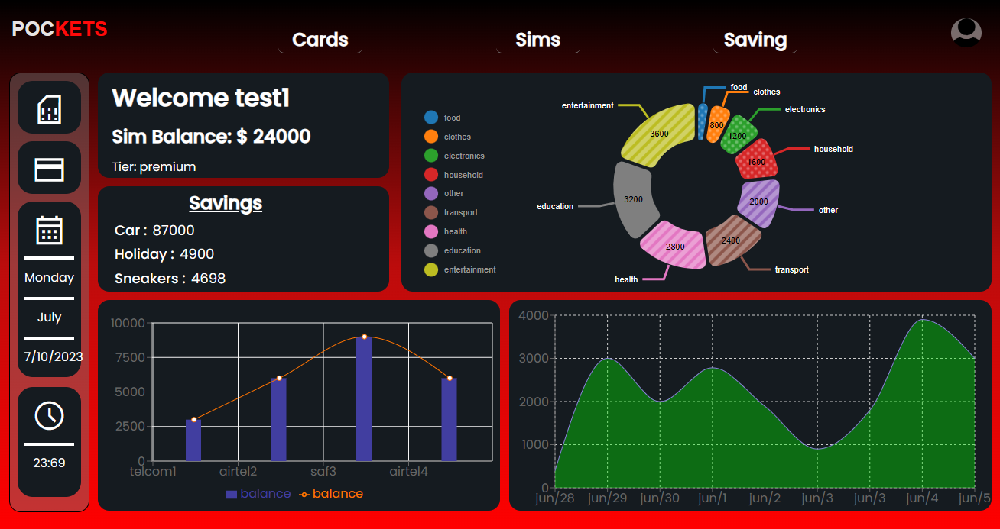
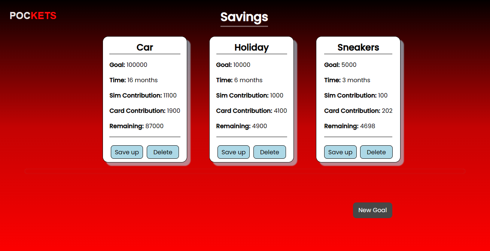

# [Pockets](https://pocketswatch.vercel.app/)

A web application that helps users manage their financial transactions and track their expenses. The application allows users to add and view transactions for their cards/sims and provides visual representations of their spending patterns. It also includes features such as user authentication, profile management, and savings tracking.

## Table of Contents

1. [Getting started](#Getting-started)
2. [Feature](#feature)
   - [Card/Sim Management](#card_sim)
   - [Transaction Categorization](#categorization)
   - [Expense Visualization](#visual)
   - [User Profile and Settings](#prof)
   - [Savings tracking](#save)
3. [Contributors](#contributors)
4. [Licenses](#license)
5. [Technologies Used](#tech)

## <a id="Getting-started">Getting started</a>

### Direct access

You can access the site on **[Pockets](https://pocketswatch.vercel.app/)**

- Create an account and jump right in

### Cloning

**Clone** the project files to your local repository:

- HTTPS => `https://github.com/edd-ie/pockets.git`
- SSH => `git@github.com:edd-ie/pockets.git`
- Git CLI => `gh repo clone edd-ie/pockets`

Open the terminal and install all dependencies using.

```
npm install
```

In the terminal run this command to start the react app (accept the assigning of a new port if prompted)

```
npm run dev
```

## <a id="feature">Features</a>

### <a id="card_sim">Card/Sim Management</a>

Users can view and add transactions for different cards. They can click on a card to view its transactions and add new transactions for that card.



### <a id="categorization">Transaction Categorization</a>

Users can categorize their transactions based on predefined categories such as food, clothes, electronics, household, transport, health, education, entertainment, and other. This helps in tracking and analyzing expenses in different categories.



### <a id="visual">Expense Visualization</a>

The application provides visual representations of spending patterns through various charts and graphs. Users can view a pie chart showing the distribution of expenses across different categories. They can also view an area chart and a composed chart to analyze their expenses over time.



### <a id="prof">User Profile and Settings</a>

Users can manage their profile information and settings. They can update their personal details, change their subscription plan, and log out from the application.

### <a id="save">Savings Tracking</a>

The application allows users to track their savings. They can view the remaining amount for each savings category and monitor their progress towards their savings goals.



### <a id="contributors">Contributors</a>

This project was a team effort from the following individuals :

- [Edd.ie](https://github.com/edd-ie)
- [Glory](https://github.com/Nkathaglow)
- [Austin](https://github.com/Naulikha)

### <a id="license">Licenses</a>

The project is licensed under the [BSD 3-Clause "New" or "Revised" License](https://github.com/highlightjs/highlight.js/blob/main/LICENSE)

### <a id="tech">Technologies Used</a>

The project is built using the following technologies:

- Front-end: React.js, React Router, Google Icons
- Back-end: Ruby on Rails
- Database: PostgreSQL
- Styling: Pure CSS
- Charting Libraries: Recharts, Nivo
